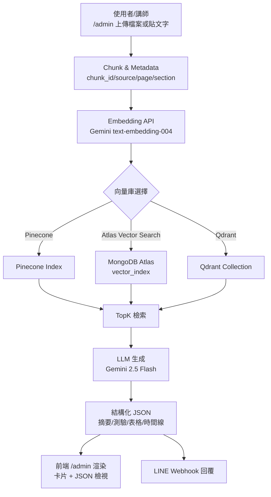

# 流程示意（Mermaid）

下圖描述上傳 → chunk → embedding → 向量索引 → 檢索 → 生成 → 前端/LINE 的完整路徑，並標示可替換的向量庫（Pinecone / Atlas / Qdrant）。

說明：
- D 節點代表可替換的向量後端；本專案預設 Pinecone，也提供 Atlas、Qdrant 设置文件。
- G 節點輸出結構化 JSON（六種模式），前端與 LINE 可共用同一份回傳。
- 若需外部後端，`/api/test` 的 `mode` 參數與同樣的檢索結果可複用。***
